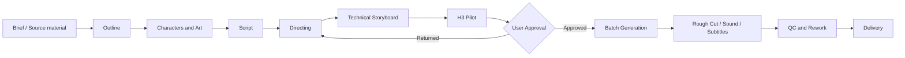

<div align="center">

# 🎬 Short Drama Production

### Turn AI video generation into a traceable, approvable, reworkable short-drama production pipeline

[](./LICENSE)


**This is not another "universal prompt."** It is a Codex-oriented AI short-drama production-control skill that connects outlines, characters, art direction, scripts, directing, technical storyboards, H3 jobs, voice, rough cuts, and QC into a stateful production chain with dependencies and approval boundaries.

**It includes MiniMax Official and CompShare H3 execution paths, is released under Apache-2.0 for reuse and extension, and can be extended with a ComfyUI API adapter when needed.**

`AI short drama` · `short drama skill` · `MiniMax H3` · `Codex Skill` · `AI Video` · `ComfyUI`

</div>

---

## CompShare registration offer

[Register for CompShare and claim the limited-time 300-credit offer](https://passport.compshare.cn/register?referral_code=8vFGBqRO6b7FYUaabHvGlW)

- MiniMax H3 API pricing starts from ¥0.08/second, with direct 1080P / 2K output.
- Claim 300 credits during the limited-time offer.
- This project includes a CompShare H3 adapter. You can also adapt the existing job contract to your own API or add a ComfyUI API adapter.

> The repository currently includes the MiniMax Official API and the CompShare reference-image-job API. ComfyUI is an extension direction, not an included plug-and-play node. Prices, credits, eligible models, and promotion dates can change; check the CompShare registration page and dashboard for the current terms.

## Why this exists

The hardest part of AI short-drama production is usually not generating one shot. It is keeping dozens of shots controllable after ongoing revisions.

| Common production problem | How Short Drama Production handles it |
| --- | --- |
| A character or set changes upstream while downstream work still uses old assets | Records artifact hashes and dependencies, propagates `stale` status automatically, and requires reapproval |
| Directorial intent, technical storyboards, and model prompts overwrite one another | Separates directorial intent from technical execution and keeps a deviation audit trail |
| Paid batches are generated immediately, multiplying mistakes | Starts with a high-exposure pilot; submissions, batches, and retries require explicit confirmation |
| "Realism" is only a filter, with no real spatial logic | Audits function, equipment, topology, human flow, operating state, and lived-in detail before image generation |
| More and more references lock movement or create extra hands | Separates semantic references from keyframes and routes work through T2VA / I2VA / FL2VA / L2VA / Ref2VA |
| Voice discovery, licensing, and final voice masters are mixed together | Manages discovery, auditioning, licensed cloning, master registration, and permitted use separately |
| A video is watchable but cannot be reliably revised | Uses `production.json` to record jobs, approvals, failure causes, rough cuts, and QC state |

## A production chain you can actually run



Core state lives only in `production.json`. Specialist JSON files own content; the control layer stores only paths, hashes, dependencies, approvals, and job state, preventing large blocks of creative content from being duplicated into context.

## Core capabilities

### 1. Producer-grade state management

- Artifact registration, dependency hashes, stale propagation, and reapproval.
- Job-level risk, cost confirmation, and failure-cause recording.
- Precise identification of affected downstream work after upstream changes, rather than rechecking an entire drama from scratch.

### 2. Separate directing from technical storyboards

- Preserves dramatic intent, blocking, shot size, camera angle, movement, and rhythm.
- Supports two independent routes: a director bridge package and a standard `novel-storyboard export` package.
- Storyboard-image prompts come before candidate assets; final H3 prompts come after asset acceptance, preventing the workflow from generating bad images first and then bending prompts around them.

### 3. Reality grounding gate

- Checks spatial function, facilities and equipment, human behavior, circulation, crowd density, and operating state.
- An "empty establishing shot" does not automatically erase required equipment, traces of daily work, or public-space foot traffic.
- For functional spaces such as stations, offices, and hospitals, validates structural plausibility before judging visual beauty.

### 4. MiniMax H3 multimodal execution

- Uses the official `h3-prompt-writing` skill to structure final H3 prompts.
- Supports reference images, video, and audio; preflight checks; submission confirmation; polling; and downloading through the MiniMax Official API.
- Includes a CompShare reference-image-job adapter with Context-IR experiment records and pre-submission validation.
- Describes in-frame movement separately from camera movement; adjusts pacing by retiming shots rather than globally speeding up a finished video.

### 5. Voice-asset management

- Supports Fish Audio public voice discovery, auditions, licensed cloning, and voice-master registration.
- Records voice source, rights scope, and `evaluation-only` restrictions.
- Decouples voice assets from characters, dialogue, and final video jobs, making replacement possible without breaking the full production chain.

### 6. Rough cuts, QC, and cost boundaries

- Produces an FFmpeg sequential rough-cut plan and can execute it explicitly.
- Paid submissions, batch jobs, retries, publishing, and replacement of final output all require confirmation for the current action.
- Checks existing external jobs before resubmitting instead of blindly creating duplicates.

## Quick start

### 1. Install

Copy this directory into the Codex skills directory:

```text
~/.codex/skills/short-drama-production/
```

Runtime requirements:

- Node.js 18+: core state, bridge, H3 Official adapter, and tests.
- Python 3.10+: CompShare client.
- FFmpeg / ffprobe: actual rough-cut execution and media inspection.
- API keys for the relevant services: keep them only in environment variables or local secret files; never commit them to the repository.

### 2. Invoke it in Codex

```text
$short-drama-production Create 16:9 short-drama production state for this project. Inspect existing artifacts and dependencies first, and do not submit any paid jobs.
```

You can also ask it to continue a project, check status, analyze the impact of upstream changes, prepare an H3 pilot, or organize a rough cut.

### 3. Check status on the command line

```bash
node scripts/production-kit.mjs init <project-dir> --title <title> --source <source-file> --aspect 16:9
node scripts/production-kit.mjs status <project>/production.json
node scripts/production-kit.mjs validate <project>/production.json
node scripts/production-kit.mjs refresh <project>/production.json
node scripts/production-kit.mjs render <project>/production.json > production-report.md
```

See [`SKILL.md`](./SKILL.md) and [`references/`](./references/) for the full command set and data structure.

## Two storyboard-ingestion routes

| Route | Use when | Behavior |
| --- | --- | --- |
| Director bridge | You already have `director-package.json` | Uses `storyboard-bridge.mjs` to preserve directorial intent and audit deviations, then synchronizes H3 jobs |
| Standard storyboard package | You already have `novel-storyboard export/manifest.json` | Uses `jobs-sync-package` directly without passing through the bridge again |

The routes are alternatives; they do not import the same storyboards twice.

## Execution adapters

| Component | Implemented capability | Current boundary |
| --- | --- | --- |
| MiniMax Official H3 | Multimodal references, preflight, confirmed submission, polling, download | You provide the official API key |
| CompShare H3 | Local reference-image embedding, preflight, Context-IR, confirmed submission | Current adapter supports reference-image jobs only |
| Fish Audio | Voice discovery, auditions, licensed cloning, master registration | Does not replace a rights assessment |
| FFmpeg | Sequential rough-cut plan, explicit execution, basic media QC | Does not provide complex multitrack editing or grading |

## Safety design

- **No spending by default:** dry runs, preflight, and pilots come first; no paid job is submitted without explicit confirmation.
- **No secret leakage by default:** keys are read only from environment variables or local secret files, never written to the project, logs, or repository.
- **No blind retries by default:** query existing jobs first; a retry counts as a new paid action.
- **Approvals are hash-bound:** a file change invalidates its old approval, preventing approval from persisting after content changes.
- **Voice rights are traceable:** voices with unknown origin or insufficient rights can only be marked for evaluation.

## Project layout

```text
short-drama-production/
├── SKILL.md                         # Codex entry point and core operating rules
├── LICENSE                          # Apache License 2.0
├── agents/
│   └── openai.yaml                  # Skill UI metadata
├── references/                      # Specialist workflow guides loaded by stage
├── scripts/
│   ├── production-kit.mjs           # State, dependencies, approvals, and job control
│   ├── storyboard-bridge.mjs        # Director-package bridge
│   ├── h3-official.mjs              # MiniMax Official H3 adapter
│   ├── compshare-h3.py              # CompShare H3 adapter
│   ├── fish-voice.mjs               # Fish Audio voice adapter
│   ├── post-kit.mjs                 # Rough cut and basic QC
│   └── selftest.mjs                 # Deterministic regression tests
└── README.md
```

## Verification

```bash
node scripts/selftest.mjs
python scripts/compshare-h3.py --help
```

The current release package includes **21 deterministic tests**, covering initialization, dependency invalidation, approvals, both storyboard-ingestion routes, H3 preflight, CompShare payment confirmation, voice registration, rough cuts, and reality-grounding audits.

## Recommended companion skills

Install specialist creative stages as needed:

- `novel-outline`: adaptation outline.
- `novel-characters`: character design and voice direction.
- `novel-art`: sets and narrative props.
- `novel-script`: structured scripts.
- `short-drama-director`: dramatic breakdown, blocking, shot size, camera angles, and camera movement.
- `novel-storyboard`: technical storyboards and H3 production packages.
- `h3-prompt-writing`: official MiniMax H3 prompt structure.

If a specialist skill is missing, a `manual` artifact can still enter the control layer, but this skill must not pretend it has that specialist quality gate.

## Current boundaries

This project does not embed media-generation models and does not provide automatic lip-sync repair, source separation, complex multitrack editing, color grading, or frame-by-frame visual inspection. It solves production organization, execution constraints, and traceable rework; external generation capabilities connect through adapters or independent artifacts.

## License

This project uses the [Apache License 2.0](./LICENSE). You may use, copy, modify, and distribute it, including as the basis of your own workflow, subject to the license's notice, modification-notice, and related requirements.
